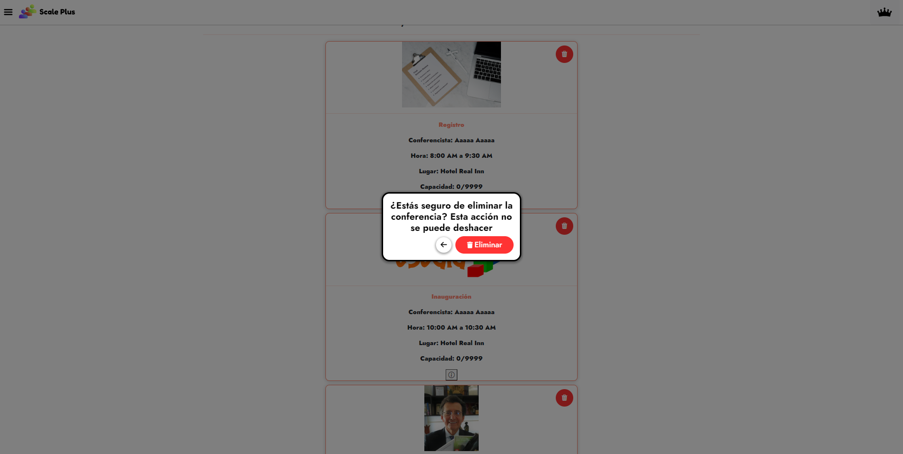

# ❌ Eliminación de Noticia/Taller/Conferencia

El usuario administrador es capaz de eliminar noticias, talleres y conferencias.

Para realizar esta acción, como administrador, se accede mediante [**Menú** ](../../funcionalidades/menu.md)a la sección de la cual queramos eliminar elemento y luego podremos ver que cada elemento tiene un botón **Eliminar** (representado con un icono de bote de basura) y solo hay que hacer click en el botón de elemento a eliminar. Antes de eliminar por completo el elemento, se presentará un mensaje de confirmación.

<figure><figcaption>
Pantalla “Talleres” (Administrador).
</figcaption></figure>

<figure><figcaption>
Pantalla “Conferencias” (Administrador).
</figcaption></figure>

<figure><figcaption>
Mensaje de confirmación
</figcaption></figure>
