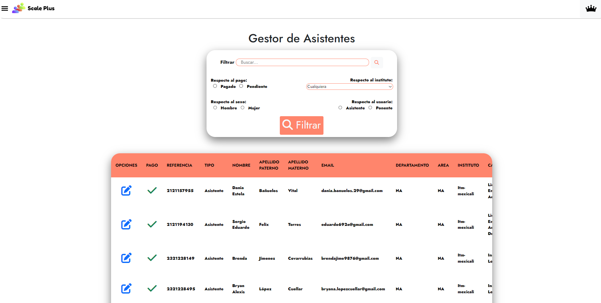

# 📊 Gestor de asistentes

Nuestro Gestor de Asistentes te ofrece una visión general de los participantes del congreso, la cual incluirá información relevante, como el nombre del participante, su carrera o profesión, el género y el tipo de usuario (estudiante o ponente). La lista de asistentes pueden filtrarse según ciertos factores tales como:

* Respecto a género (hombre o mujer)
* Respecto a estado de pago (pendiente o pagado)
* Respecto a la carrera
* Respecto al tipo de usuario (estudiante o ponente)

Esta sección de la aplicación administra los datos de los usuarios registrados, siendo capaz de editar datos o eliminarlo.&#x20;

<figure><figcaption></figcaption></figure>

