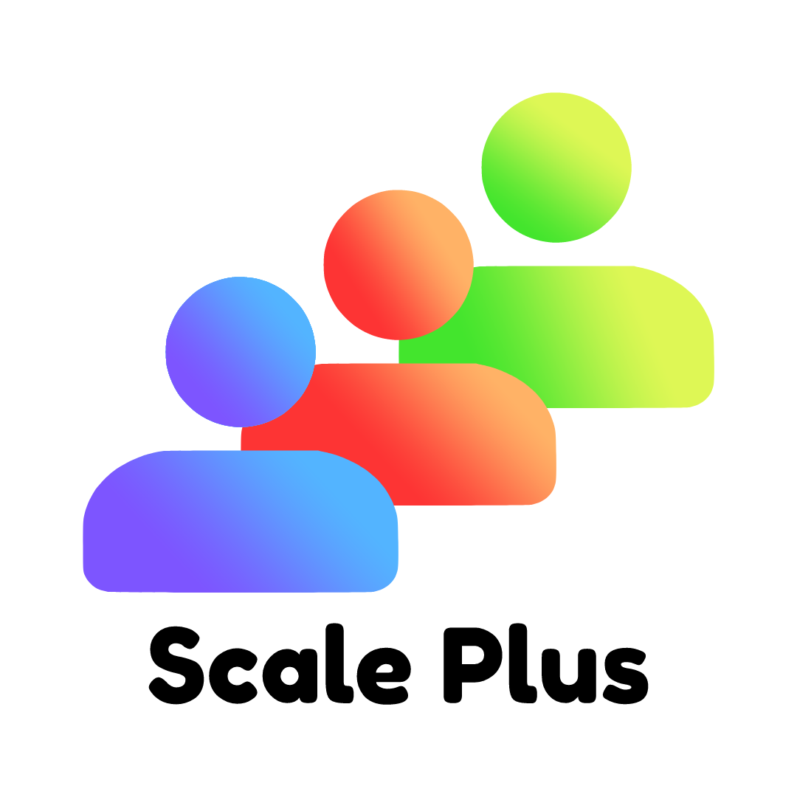

# 💡 Bienvenido

¡Bienvenido al futuro de la gestión de congresos a gran escala! Con nuestra aplicación de gestión de congresos, podrá organizar y participar en eventos sin esfuerzo. Nuestra plataforma integra todas las funcionalidades necesarias para planificar, promocionar y gestionar su próximo evento de manera efectiva y eficiente.

¿Está cansado de hacer malabarismos con múltiples herramientas y servicios para gestionar tu evento? ¡Ya no más! Con nuestra aplicación, tendrá todo lo que necesita en un solo lugar. Podrá crear una página personalizada para tu evento, gestionar los registros de asistentes, enviar correos electrónicos personalizados y gestionar pagos, todo desde una plataforma centralizada.

<figure><figcaption>
Logo Scale Plus
</figcaption></figure>

Además, nuestra aplicación es totalmente personalizable para satisfacer las necesidades de cualquier tipo de evento, desde conferencias empresariales hasta podcasts de las conferencias. Ya sea que necesite gestionar a los usuarios registrados o la cantidad de ingresos generados, nuestra aplicación le ayudará a llevarlo a cabo sin esfuerzo.

En resumen, nuestra aplicación de gestión de congresos es la solución integral que estaba buscando para organizar y participar en eventos a gran escala. Con la capacidad de simplificar sus procesos de planificación y gestión, le garantizamos que tu evento será todo un éxito. ¡Únete a la revolución de la gestión de congresos hoy mismo!
