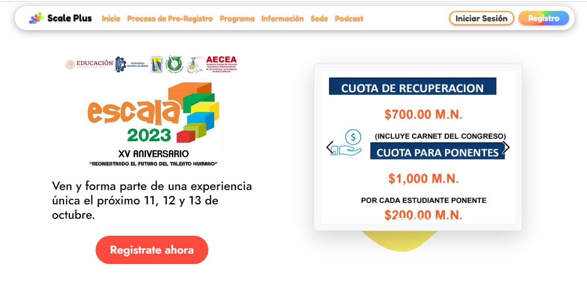

# ✉ Convocatorias

Se despliega la convocatoria en curso del congreso o de futuros congresos. Se presente información relevante del congreso así como horarios y los eventos que en se llevarán a cabo.

La convocatoria se encuentra disponible mediante la pantalla de [Novedades](novedades.md).

<figure><figcaption></figcaption></figure>
