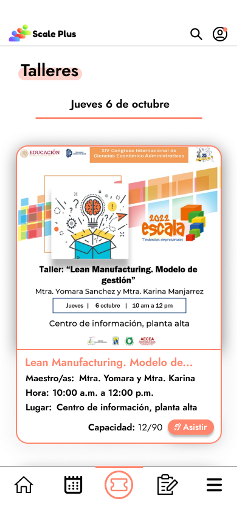
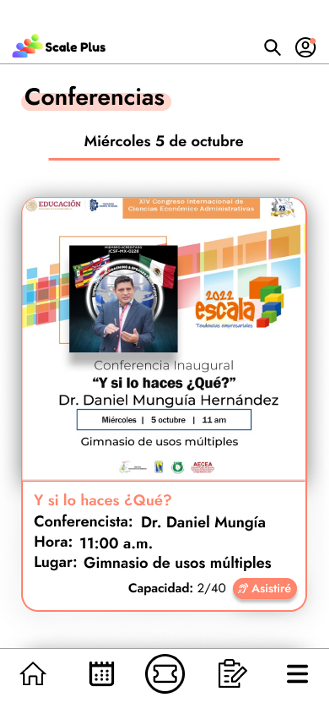

# 🗓 Eventos

Talleres

El apartado de talleres permite principalmente observar todos los talleres disponibles dentro del congreso y desplegar información relevante a ellos.

#### Asistencia a talleres

Una vez dentro del apartado de talleres, nos permitirá elegir si queremos asistir a uno de los talleres que se ofertarán dentro de esta sección.

#### Capacidad en tiempo real

Muestra la capacidad del taller en cuestión en tiempo real, así es más fácil saber cuando hay cupo disponible y no se ofertan espacios que no existen.

Conferencias

El apartado de conferencias permite principalmente observar todos las conferencias disponibles dentro del congreso y desplegar información relevante a ellas.

#### Asistencia a conferencias

Una vez dentro del apartado de conferencias, nos permitirá elegir si queremos asistir a uno o más de uno de las conferencias que se ofertarán dentro de esta sección.

#### Capacidad en tiempo real

Muestra la capacidad de la conferencia en cuestión en tiempo real, así es más fácil saber cuando hay cupo disponible y no se ofertan lugares de más.

