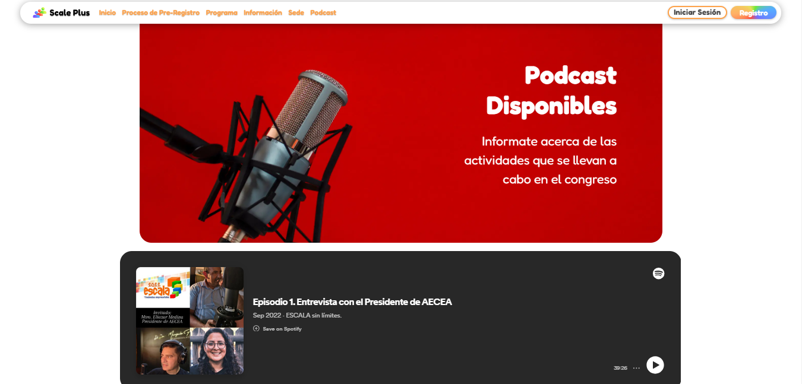

# 🎧 Podcasts

El apartado de podcast permite principalmente desplegar grabaciones de las conferencias o ponencias en formato de audio.

En el caso del administrador, este será capaz de añadir nuevos podcasts a esta sección.

<figure><figcaption></figcaption></figure>
