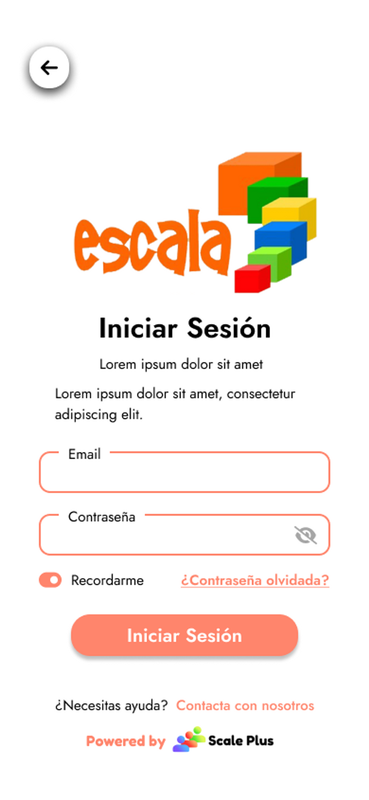
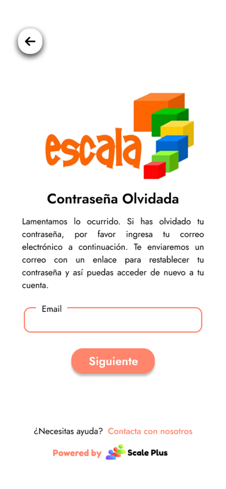

# 📍 Inicio de sesión

<figure><figcaption>
Inicio de sesión
</figcaption></figure>

### Iniciar sesión

El usuario ingresará sus credenciales (email y contraseña) para iniciar sesión y entrar a su cuenta y acceder a las diferentes funciones como usuario dentro del software.

Estas credenciales pueden ser guardadas al presionar el botón de “Recordarme” para así evitar iniciar sesión cada vez que queramos ingresar a nuestra cuenta.

### Cambio de contraseña

Si el usuario pierde la contraseña es posible recuperarla a partir de proporcionar el correo electrónico registrado para su cuenta.

Posteriormente así enviar un correo con un enlace al proceso de cambio de contraseña donde se ingresará la contraseña nueva y posteriormente ingresar a su cuenta usando dicha nueva contraseña.

<figure><figcaption></figcaption></figure>
