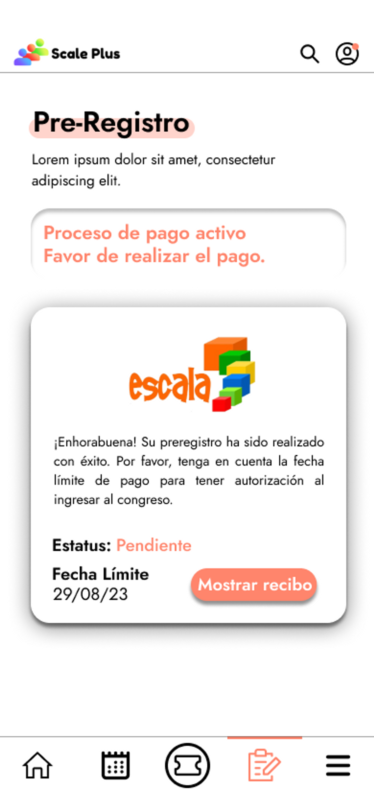
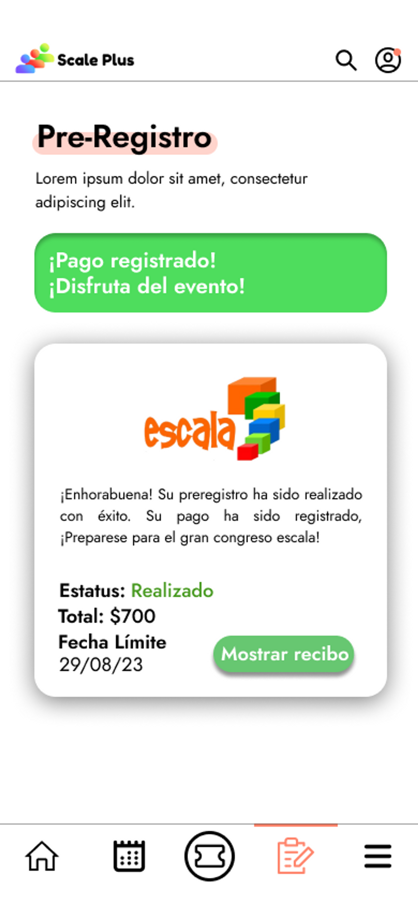

# 📝 Pre-registro

El apartado de pre-registro, nos permitirá realizar el pre-registro y una vez llenado el formulario, es capaz de seguir el proceso de registro y de pago para nuestra asistencia al congreso, ya sea como ponente o como asistente.

### Pre-registrarse en el congreso

Generar línea de pago

Dentro de este mismo apartado una vez pre-registrado el usuario este podrá generar su línea de pago y nos desplegará la fecha límite de pago. Así mismo una vez generada podrá descargar el archivo de referencia de pago para presentar en alguna sucursal de banco de su elección y posteriormente realizar el pago.

Seguimiento del proceso de registro

Una característica dentro de este apartado es que todo el proceso de registro está siendo seguido por el software por lo que nos mostrará el estatus del pago antes (no registrado), durante (pendiente) y después (pagado).

