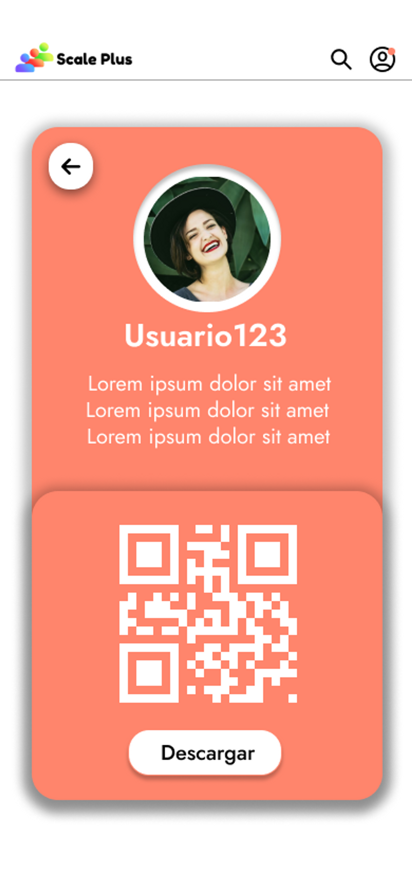

# 📲 Credencial de usuario

La credencial del usuario es una función que permite al usuario visualizar su credencial y su código QR para poder presentarlo en las diferentes actividades y eventos que se realizarán dentro del congreso escala y así registrar su asistencia. Además es posible descargar dicha credencial en formato PDF por si se requiere presentar de manera física dentro del congreso.

<figure><figcaption>
Credencial del usuario
</figcaption></figure>

<figure><figcaption>
Archivo descargable en formato PDF de la credencial del usuario
</figcaption></figure>
