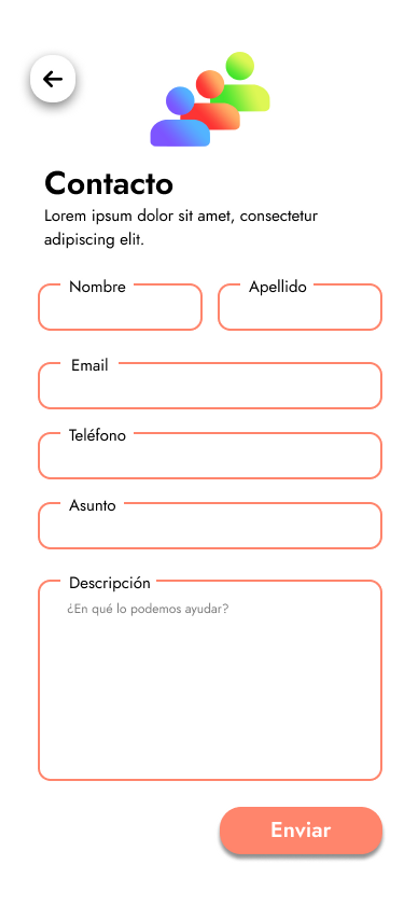

# 🖥 Soporte

En esta sección, nos enfocamos en proporcionarte asistencia y atención personalizada para resolver cualquier pregunta, inquietud o dificultad que puedas tener durante tu recorrido con nuestros productos o servicios.&#x20;

<figure><figcaption></figcaption></figure>

Nuestro objetivo es asegurarnos de que te sientas apoyado y seguro en cada paso del camino.&#x20;

Nuestro equipo de soporte altamente capacitado está a tu disposición para ayudarte a sacar el máximo provecho de nuestros productos y para responder cualquier consulta que puedas tener. Ya sea que necesites orientación en la configuración inicial, solución de problemas técnicos, asesoramiento sobre características o cualquier otro aspecto relacionado con nuestro servicio.

Para contactarnos, solamente tiene que hacer click en el icono de usuario (simepre y cuando ya este registrado y tenga la sesión iniciada) Esto abrirá la barra lateral y solo hay que seleccionar la opción de **Contactar Soporte**. Posteriormente podrá llenar el formulario con la información que desee enviar a Soporte.

<figure><figcaption>
Barra lateral ampliada del usuario
</figcaption></figure>

<figure><figcaption>
Formulario de contacto con los desarrolladores del software.
</figcaption></figure>
